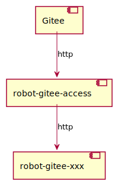
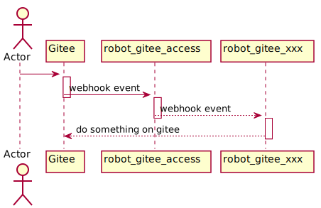

This is a library to make the development of a robot based on [Gitee](https://gitee.com) simpler.

# Functions
- [config](https://github.com/opensourceways/community-robot-lib/blob/master/config)

  It is a common component which includes a agent to watch the config file of robot and a repository filter([RepoFilter](https://github.com/opensourceways/community-robot-lib/blob/master/config/repo_filter.go#L9)) which can restrict the config to a specified organization or a repository.

- [giteeclient](https://github.com/opensourceways/community-robot-lib/blob/master/giteeclient)

  It is a swapper to encapsulate dozens of frequently-used Gitee APIs.

- [interrupts](https://github.com/opensourceways/community-robot-lib/blob/master/interrupts)

  It is copied from [prow](https://github.com/kubernetes/test-infra/tree/master/prow/interrupts) and implement the function to control the exit of service.

- [logrusutil](https://github.com/opensourceways/community-robot-lib/blob/master/logrusutil)

  It is copied from [prow](https://github.com/kubernetes/test-infra/tree/master/prow/logrusutil) and implement the function to print log.

- [options](https://github.com/opensourceways/community-robot-lib/blob/master/options)

  It includes the common options for a robot.

- [robot-gitee-framework](https://github.com/opensourceways/community-robot-lib/blob/master/robot-gitee-framework)

  It is the framework of robot based on Gitee. It implements the interfaces to register the event handler and dispatch the event to each handler.
  It is very easy to implement a new robot based on Gitee with it.
  
- [robot-gitee-template](https://github.com/opensourceways/community-robot-lib/blob/master/robot-gitee-template)

  It is the template of a robot based on Gitee. The robot uses the Bazel to manage the dependencies.
  The [build.sh](https://github.com/opensourceways/community-robot-lib/blob/master/robot-gitee-template/build.sh) is the useful tool to compile and build image.

- [secret](https://github.com/opensourceways/community-robot-lib/blob/master/secret)

  It is a common component which can watch the secret files of robot.

- [tools](https://github.com/opensourceways/community-robot-lib/blob/master/tools)

  It includes two useful scripts.

  The **new_robot.sh** can geneate the initial robot codes by downloading the files in the [robot-gitee-template](https://github.com/opensourceways/community-robot-lib/blob/master/robot-gitee-template).

- [utils](https://github.com/opensourceways/community-robot-lib/blob/master/utils)

  It includes several useful functions which may be used in robot.

# How to develop a robot with this lib.
The current available robots are [**these**](https://github.com/opensourceways?q=robot-gitee-&type=public&language=&sort=name). They are the good examples to help you develop your own.

It is very easy to develop a robot by the help of [new_robot.sh](https://github.com/opensourceways/community-robot-lib/blob/master/tools/new_robot.sh).
Dowload and run it on the shell to generate the initial codes of robot.

```shell

# ./new_robot.sh

Usage: new_robot.sh robot-name dir-of-robot remote-repository-of-robot.

For Example: new_robot.sh test . github.com/opensourceways

The command above will
generate codes at current dir with robot name of 'robot-gitee-test' and
import path of 'github.com/opensourceways/robot-gitee-test'.

# ./new_robot.sh test . github.com/opensourceways

Info: the robot name should have prefix of 'robot-gitee', and will be changed to robot-gitee-test.

Cloning into 'community-robot-lib'...
remote: Enumerating objects: 441, done.
remote: Counting objects: 100% (441/441), done.
remote: Compressing objects: 100% (321/321), done.
remote: Total 441 (delta 257), reused 234 (delta 108), pack-reused 0
Receiving objects: 100% (441/441), 165.70 KiB | 2.24 MiB/s, done.
Resolving deltas: 100% (257/257), done.
Initialized empty Git repository in /data/go_workspace/workspace/src/github.com/opensourceways/robot-gitee-test/.git/
[master (root-commit) a5d4c0d] init repo
 10 files changed, 456 insertions(+)
 create mode 100644 .bazelrc
 create mode 100644 .bazelversion
 create mode 100644 .gitignore
 create mode 100644 BUILD.bazel
 create mode 100644 WORKSPACE
 create mode 100755 build.sh
 create mode 100644 config.go
 create mode 100644 main.go
 create mode 100755 publish/command_status.sh
 create mode 100644 robot.go

```

It generates 3 go files(main.go, config.go, robot.go) and you can implement the robot by modifying them or adding any arbitrary go files.

# How to run a robot
The robot use Bazel to compile and build/push image, so it should install it first.
You can reference [**here**](https://docs.bazel.build/versions/main/install.html) to install it.
Besides the robot had preset the version of bazel in file of `.bazelversion`, so it should install the one with matched version.

When you finish developping a robot, run `./build.sh build` to compile, which will genereate a binary file.
Take [robot-gitee-sweepstakes](https://github.com/opensourceways/robot-gitee-sweepstakes) as an example.

```shell

# ./build.sh build

*************** update repo ***************

Starting local Bazel server and connecting to it...
INFO: Analyzed target //:gazelle (66 packages loaded, 6952 targets configured).
INFO: Found 1 target...
Target //:gazelle up-to-date:
  bazel-bin/gazelle-runner.bash
  bazel-bin/gazelle
INFO: Elapsed time: 44.495s, Critical Path: 7.82s
INFO: 36 processes: 36 linux-sandbox.
INFO: Build completed successfully, 49 total actions
INFO: Build completed successfully, 49 total actions
INFO: Analyzed target //:gazelle (4 packages loaded, 93 targets configured).
INFO: Found 1 target...
Target //:gazelle up-to-date:
  bazel-bin/gazelle-runner.bash
  bazel-bin/gazelle
INFO: Elapsed time: 2.306s, Critical Path: 0.10s
INFO: 0 processes.
INFO: Build completed successfully, 1 total action
INFO: Build completed successfully, 1 total action

*************** build binary ***************

INFO: Build option --platforms has changed, discarding analysis cache.
INFO: Analyzed target //:robot-gitee-sweepstakes (19 packages loaded, 7143 targets configured).
INFO: Found 1 target...
Target //:robot-gitee-sweepstakes up-to-date:
  bazel-bin/robot-gitee-sweepstakes_/robot-gitee-sweepstakes
INFO: Elapsed time: 23.741s, Critical Path: 17.52s
INFO: 21 processes: 21 linux-sandbox.
INFO: Build completed successfully, 24 total actions

```

The target binary is at `bazel-bin/robot-gitee-sweepstakes_/robot-gitee-sweepstakes`.

Next, it is time to start it. Before starts it, there are 2 steps to be done.

- It should create a config file with format of yaml which is needed by the robot.

- It should generate a personal token of a robot account on Gitee and save it in a file.

```shell

# cat config.yaml

config_items:
- repos:
  - zengchen1024/repo-test
  congratulation: "congratulation"

# ./robot-gitee-sweepstakes --port=8888 --config-file=./config.yaml --gitee-token-path=./token

```

The command above will start the robot in a web service which is listening on port of `8888` and ready to handle the webhook event of Gitee.

# How to test a robot
The robot handles the events sent by Gitee. So, it should receive the events first. The [robot-gitee-access](https://github.com/opensourceways/robot-gitee-access) implements the function of it.

The component diagram of robots is bellow.



The sequence diagram of handling events is bellow.



Therefore, there are 3 steps to be done before testing the robot.

- First, run the robot you developed.

- Second, run robot-gitee-access.

- At last, register a webhook to Gitee with the endpoint of robot-gitee-access.

Then enjoy the game of robot.

# How to start robot-gitee-access
It is easy to start robot-gitee-access, please see the [**README**](https://github.com/opensourceways/robot-gitee-access/blob/master/README.md) to get details.
